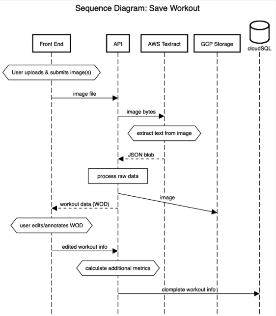

# ergTrack23 API

## Description
ergTrack is a web app for rowing athletes that harnesses computer vision to facilitate simple and quick tracking of indoor rowing workouts. 

Watch the [Demo Video](https://www.canva.com/design/DAFq-5T_Wns/TNjxCZ-VCIgUY8LpwlFUjg/watch?utm_content=DAFq-5T_Wns&utm_campaign=designshare&utm_medium=link&utm_source=publishsharelink)

## Setup for local development
1. Clone repo from GitHub 
    * clone API and front end `git@github.com:paper-dragonfly/ergTrack23-front.git` 
2. Create config folder with config.yaml file (secrets, not published on github)
    * populate config.yaml based on provided config_template.yaml 
3. Create venv `$python3 -m venv path/to/venv` and activate `$source path/to/venv/bin/activate`
4. Install required packages  `$pip install -r requirements.txt`
5. Download Google Cloud SDK (https://cloud.google.com/sdk/docs/install)
    * Need to be authenticated and connected to ergtracker project. Your account must be given permissions to access the project.
6. Download and set up postgreSQL (could skip if only using remote db)
7. Run init_db.py file to create database using alembic
8. Set up auth proxy to connect to remote database (not required for purely local developement):  
    * Download cloudSQL proxt: `curl -o cloud-sql-proxy https://storage.googleapis.com/cloud-sql-connectors/cloud-sql-proxy/v2.7.1/cloud-sql-proxy.linux.amd64`
    * Make cloudSQL proxy executable `chmod +x cloud-sql-proxy`
    * Read more about this [here](https://cloud.google.com/sql/docs/postgres/connect-auth-proxy#macos-64-bit)
9. Download docker desktop (if wanting to run app with docker locally)

### Run Locally (local db, API & front-end)
1. Set DEV_ENV `$export DEV_ENV='local'`
2. Confirm auth proxy is not running 
    * auth proxy runs in a terminal session so check open terminals if you are unsure
3. Confirm local PostgreSQL server is running 
4. Run API `$uvicorn src.main:app --reload` 
5. Run the front end (assumes you have done neccessary setup for front end)
    * confirm API_URL in front end config.txt points to `http://localhost:8000`
    * Run react `npm start`

### Run Hybrid (remote db, local API, local front end)
1. Set DEV_ENV `$export DEV_ENV='hybrid'`
2. Run auth proxy server 
```./cloud-sql-proxy --port 5432 ergtracker:us-east1:ergtrack-gc-db```
Run this in command line to allow local conection to cloud sql db
Like starting the postgreSQL 14 server when running local db

3. Run API `$uvicorn src.main:app --reload` 
4. Run the front end (assumes you have done neccessary setup for front end)
    * Run react `npm start`

### Run Docker-Compose (local db, API & front-end) 
1. `$ docker-compose up --build`
2. Open API container through docker desktop and navigate to Exec
3. Run `$ bash` 
4. Run `$ uvicorn src.main:app --host 0.0.0.0 --port 8000 --reload`

##### Testing
Unit tests are currently only available when the DEV_ENV environment variable is set to 'docker-compose'. This is to prevent accidentally erasing the production database. 
To run tests navigate to the Exec terminal and run `$bash` (like above) then `pytest`  

### Updating Requirements 
1. Inside your virtual environment install pip-tools
    ```source /path/to/venv/bin/activate```
    ```python -m pip install pip-tools```
2. List required packages in `requirements.in` 
3. Run `pip-compile requirements.in -o requirements.txt` to create requirements.txt file

### Building Docker images on M1 Mac
If you encounter the error 
```An error occurred: SCRAM authentication requires libpq version 10 or above```
You need to rebuild your image with this env var
```export DOCKER_DEFAULT_PLATFORM=linux/amd64```


### Running Integration Tests in Docker
1. Build the images, containers, and network.
```docker-compose up --build```
2. Exec into the `api` container. Docker Desktop can help you find the container id.
```docker exec -it <container-id> /bin/bash```
3. Run tests in debugger and logging mode.
```pytest -s```


### Sequence Diagram
